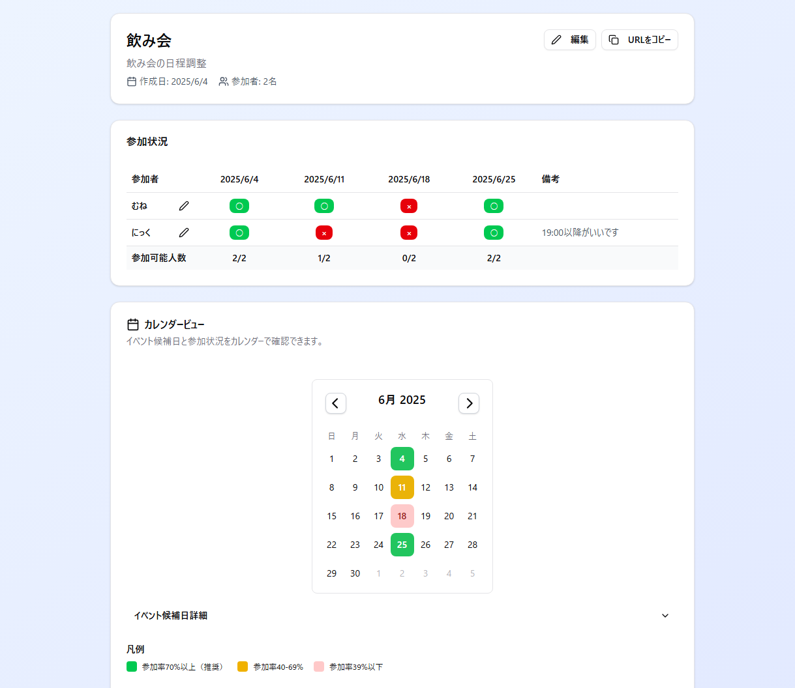
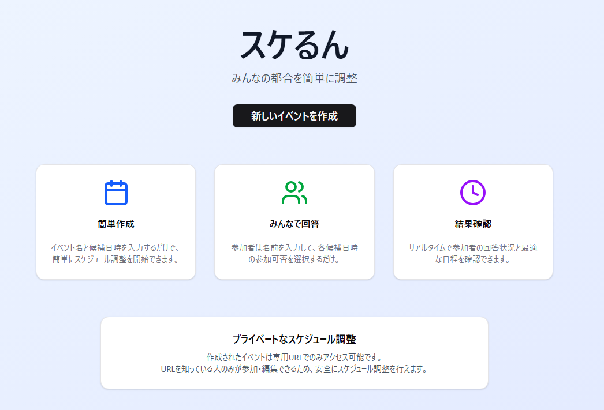
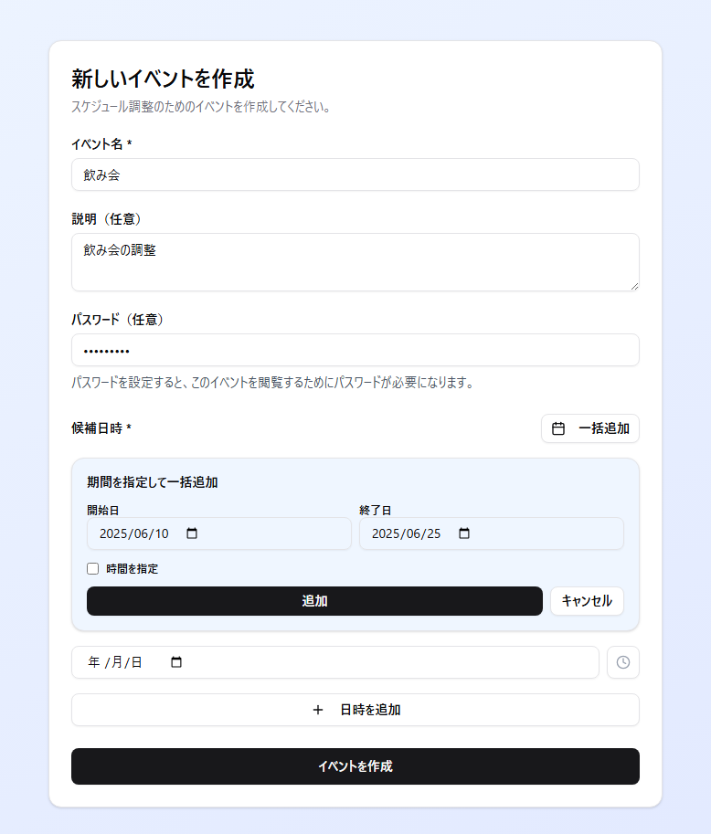
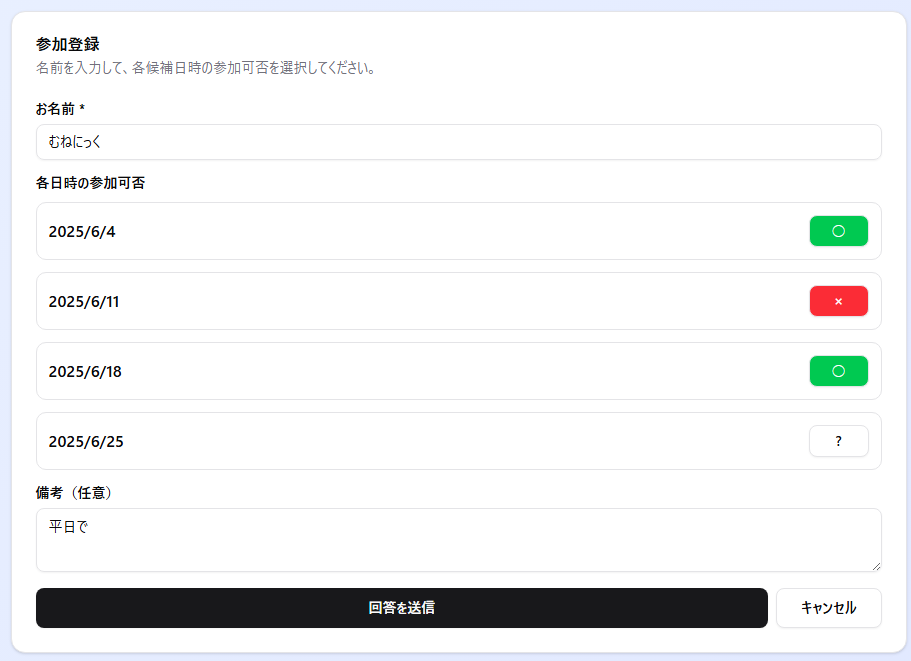

# スケるん (ScheduleN)

シンプルなスケジュール調整Webアプリケーションです。
https://schedulen.munenick.me/



## 特徴

- 📅 **簡単な候補日設定** - 日付と時間を選択して候補日を追加
- 👥 **参加者管理** - 参加者の都合を一覧で確認
- 🔒 **パスワード保護** - イベントにパスワードを設定して閲覧制限
- 📱 **レスポンシブデザイン** - PC・スマートフォン・タブレットに対応
- 🗓️ **インタラクティブカレンダー** - 日付クリックで詳細表示、参加率の視覚化
- 📚 **チュートリアル機能** - 実際に操作できる使い方ガイド
- 📋 **日程確定機能** - 複数日程の確定とカレンダー連携
- ⚡ **高速動作** - Next.js 15とPostgreSQLを使用した信頼性の高い設計

## 技術スタック

- **フロントエンド**: Next.js 15, React 19, TypeScript
- **スタイリング**: Tailwind CSS, Radix UI
- **データベース**: PostgreSQL
- **アイコン**: Lucide React
- **日付処理**: date-fns

## セットアップ

### 必要な環境

- Node.js 18以上
- pnpm (推奨) または npm
- PostgreSQL 12以上

### インストール

#### 1. Docker Composeを使用する場合（推奨）

```bash
# リポジトリをクローン
git clone https://github.com/MuNeNiCK/ScheduleN.git
cd ScheduleN

# GHCR（GitHub Container Registry）から事前ビルド済みイメージを使用
docker-compose up -d

# アプリケーションにアクセス
# http://localhost:3000
```

#### 開発環境用（ローカルビルド）

```bash
# 開発用docker-composeファイルを使用
docker-compose -f docker-compose.dev.yml up -d
```

#### 2. ローカル環境で実行する場合

```bash
# リポジトリをクローン
git clone https://github.com/MuNeNiCK/ScheduleN.git
cd ScheduleN

# 環境変数設定
cp .env.example .env.local
# .env.localファイルを編集してPostgreSQLの接続情報を設定

# 依存関係をインストール
pnpm install

# PostgreSQLデータベースを作成
createdb schedulen

# 開発サーバーを起動
pnpm dev
```

ブラウザで [http://localhost:3000](http://localhost:3000) を開いてアプリケーションにアクセスできます。

### ビルド

```bash
# プロダクション用ビルド
pnpm build

# ビルドしたアプリケーションを起動
pnpm start
```

## 使い方

### 🚀 初めての方へ
トップページの「**使い方を見る**」ボタンから、実際に操作できるチュートリアルを体験できます。
サンプルデータを使って全ての機能を試すことができ、操作時にはヒントが表示されます。

### 1. イベント作成
1. トップページから「新しいイベントを作成」をクリック
2. イベント名と説明を入力
3. 候補日時を追加（複数選択可能）
   - 時間範囲の指定も可能
4. 必要に応じてパスワードを設定
5. 「イベントを作成」をクリック

### 2. 参加状況の入力
1. 共有されたイベントURLにアクセス
2. 名前を入力
3. 各候補日に対して「参加可能」「参加不可」「未定」を選択
4. コメントを入力（任意）
5. 「回答を送信」をクリック

### 3. 結果の確認と日程確定
- **参加状況一覧表**: 全体の都合を確認、個別編集も可能
- **カレンダービュー**: 参加率を色で視覚化、日付クリックで詳細表示
- **日程確定**: 参加率の高い日程を確定し、GoogleカレンダーやiCalに出力
- **リアルタイム更新**: 新しい回答があると即座に反映

## 📚 新機能（v2.0）

### インタラクティブカレンダー
- **参加率の色分け表示**: 青（確定済み）、緑（参加率70%以上）、黄（40-69%）、薄赤（39%以下）
- **日付クリック詳細**: カレンダーの日付をクリックすると参加者一覧が表示
- **月移動ナビゲーション**: カレンダー両端のボタンで前月・翌月に移動

### チュートリアル機能
- **実操作体験**: 実際のイベントページと同じ機能をサンプルデータで体験
- **ローカルストレージ**: ブラウザに一時保存されるため、実際の追加・編集・確定操作が可能
- **ガイダンス表示**: 各操作時に右上にヒントカードが表示
- **データリセット**: いつでも初期状態に戻せるリセット機能

### 日程確定とカレンダー連携
- **複数日程確定**: 参加率の高い日程を複数同時確定可能
- **Googleカレンダー連携**: 確定日程を直接Googleカレンダーに追加
- **iCalエクスポート**: OutlookやAppleカレンダー用のiCalファイル出力
- **一括・個別出力**: 全確定日程の一括出力、または個別日程の出力が可能

## スクリーンショット

### ホーム画面


### イベント作成


### 参加登録


### イベント詳細・参加状況確認


## ライセンス

このプロジェクトはMITライセンスの下で公開されています。

## 貢献

プルリクエストや課題報告を歓迎します。

## サポート

質問や問題がある場合は、[Issues](https://github.com/MuNeNiCK/ScheduleN/issues) で報告してください。
